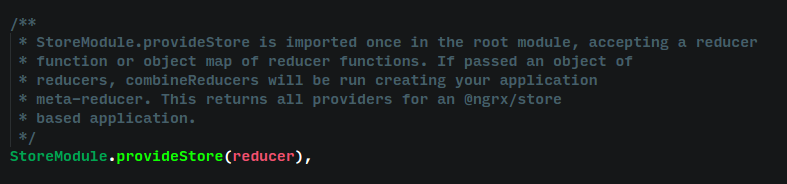
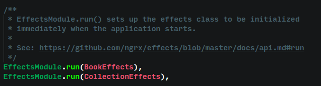

**ngrx/store**

The store will helps to solve the component interaction problems.If we
use ngrx/store in our application.There is a lot of advantages like
perfomance boost, testability and also can make it more
predictable.Ultimately stores will acts ike a client side database which
provides exact application state.

**ngrx/effects**

Instead of common @injectable angular service classes can be replaced
using @Effect.An effect is triggered when we dispatch actions from
store.Example, If i want get some data from firebase ,I have to consume
a firebase list data into oftype observable and return the result as an
observable with the help of switchMap as payload.

**angular/router - Angular Router**

Routes are one of the fundamentals of our angular framework.It has lot
of features like transforming as a guard, navigation, get route
information, activation of child components based on conditions etc.

There are 4 routes in ngrx-example

-   Collection

-   Find book

-   Book detailed view

-   Page not found

In detailed book component , we can see the implementation of an angular
guard.ie, canActivate .This guard decides whether a route can activate
or not.And inside the gaurd class we can an activatedRouteSnapshot, this
will helps to get current state of that route.

**ngrx/db**

A reactive database uses the codebase of indexdb.Analyzed its repository
on github feels like abandoned.

**ngrx/store-devtools**

This can be downloaded from crome store as redux devtools extension.This
will helps to observethe realtime state changes and its values.Also this
tool comes along with a time travel feature.

Simply we can include in the Application module and start the debugger
from chrome as an extension.

**codewareio/ngrx-store-freeze **

The reducer is a pure function which mutates the state.So the
ngrx-store-freeze is used to restrict the state mutation.

**Reselect**

It is an redux library that is used to deal with derived data.Derived
data is something obtained from another an arithmetic or logic
transformation.

**Ngrx-example App Observations**

The application bootstraps at main.ts

Then the default route get called. ie.CollectionPageComponent

Each redux application will be consist of three main concepts, store,
actions and reducers.

Here the change detection strategy is onPush.There are two methods for
change detection.One is onPush and another is default.If we change to
onPush the changes will be detected only if and input changes or any
event emitted.This will improve the overall perfomance of the
apllication.

**Store**

Store plays an important role in every redux based application.Store is
single and immutable.This will change the state of item only through
defined and dispached actions.In this application the store module is
imported in the app module as StoreModule.provideStore(reducers).

When the store dispatches a search action this ,Dispatcher is like a
messenger.This will inform all.

This will call the action from book.ts and executes the reducer logics.

**Reducers**

Reducers are pure functions.It takes two arguments.The previous state
and an optional payload.

If we considering store as a database then the reducers are the tables.

Sample reducer

In this application there is a reducer folder and consist of books,
collection, search and layouts with their test written files.

Our book reducer has a switch case inside the function and this will
return according to the action type.

If the case SEARCH\_COMPLETE passes by recieving the "\[Book\] Search
Complete" then it initiate the LOAD\_SUCCESS. In the
actions/collections.ts we can see like this.

The action payload will contains the array of books obtained from the
search.The newbooks filter will compare with prev state and filter to
new books.

**Actions**

All interactions that would update state of the application must
explicitly added as actions.

These are the types of actions defined for book.ts

**How are effects created?**

Effects actually reduces the side effects.This is also a place we can
put our async requests.These are used to load retrieved data into
application internal state without making any side effects.

-   First install ngrx/effects using npm to our application

-   Then import into our modules

Example

-   Create an effects component

    In this application ie, effects/book.ts

-   Then create a class BookEffects with @Injectable decorator and
    insidethe class have to use @Effect decorator.This has certain
    parameters like ofType, switchMap.

-   Inside this we have to call the service.In this scenario we have to
    call the google book search api.

The above image from ngrx-example shows Book effect.

**What is the use case for the src/app/guards/book-exists.ts guard?**

The BookExistsGuard is called inside routes.ts. This is passed into
canActivate property of book/: id route.

canActivate property decides if a route can be activated.

On the initialization of guard.The methord waitForCollectionToLoad()
create an Observable and waits for has finished to return true.

Guards must return an Observable of true or false.

**How are the components created, what does the components do?**

-   Create a file with @component decorator also need to import
    from core.

-   Then create a class for component

-   Specify meta data for the component.

-   Then in redux model, the components will have @Input and Output.

-   The @Input is used to get inputs from other components.

-   The @Output will be an event emitter.

-   Also we can explicitly create getter and setter methods for
    binding properties.

Components are the fundamentals of any angluar application.The view and
extrenal styles are included in the metadata of the component.

**Can the components directly talk to the middleware?**

If the question is about store middleware,that has been removed from
ngrx/storeV2 and introduced meta reducer.The ngrx team decided use meta
reducer instead of that.This can be imported to the component and we can
pass as argument to store inside the component. So i think the answer is
NO.
